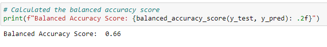

# Credit Risk Analysis

## Project Overview
Machine learning is to be utilized to analyze credit card risk.  Using the credit card dataset from LendingClub, different techniques are employed to train and evaluate models with unbalanced classes to predict credit risk. 

## Resources
 - Data:  [LoanStats_2019Q1.csv](LoanStats_2019Q1.csv)
 - Software: Python v. 3.7.11, Jupyter Notebook v. 6.3.0

## Results
The dataset was loaded into a dataframe and then cleaned.  Using the get_dummies method, data features and the target were created.  After checking the y value counts, the data was split into training and testing before proceeding with the techniques below.

### Resampling Models
 - Oversampling with RandomOverSampler: The object of this model is to over-sample the minority class(es) by picking samples at random with replacement.

   - Balanced Accuracy Score: 66%.
   

   - High Risk had a precision rate of 1% and a recall of 72%.
   - Low Risk had a precision rate of 100% and a recall of 60%.

   

   

 - SMOTE Oversampling: Synthetic Minority Over-sampling Technique selects a random minority class and finds its nearest minority class neighbors.  A randomly selected neighbor is chosen and a synthetic sample is created at a random, selected point on the line between the original selected minority class and the randomly selected neighbor.

   - Balanced Accuracy Score: 66%
   

   - High Risk had a precision rate of 1% and a recall of 72%.
   - Low Risk had a precision rate of 100% and a recall of 60%

   

   

 - Cluster Centroids undersampling: This method under samples the majority class.

   - Balanced Accuracy Score: 54%
   

   - High Risk had a precision rate of 1% and a recall of 69%.
   - Low Risk had a precision rate of 100% and a recall of 40%.

   

   

 - Combination Sampling with SMOTEEN: This model is a two step process.  It first oversamples the minority class with SMOTE.  Then it cleans the resulting data with an undersampling strategy, Edited Nearest Neighbors (ENN).

   - Balanced Accuracy Score: 68%
   

   - High Risk had a precision of 1% and a recall of 78%.
   - Low Risk had a precision of 100% and a recall of 57%

   

   

### Ensemble Models

 - BalancedRandomForest: This model is an ensemble of decision tree models.  It selects bootstrap samples from the training dataset and fits a decision tree on each.  However, not all features are used but instead a small, randomly selected set of features are chosen for each bootstrap sample.

   - Balanced Accuracy Score: 79%
   

   - High Risk had a precision of 3% and a recall of 70%
   - Low Risk had a precision of 100% and a recall of 87%

   

   [brf_classification_report](Resources/brf_classification_report.png)

 - EasyEnsemblerClassifier:  This model involves creating balanced samples of the training dataset by selecting all samples from a minority class and a subset from a majority class.  Then the AdaBoost algorithm is used on each subset.

   - Balanced Accuracy Score: 93%
   

   - High Risk had a precision of 9% and a recall of 92%.
   - Low Risk had a precision of 100% and a recall of 94%

   

   

## Summary
Of the six models used, the EasyEnsembleClassifier model performed the best.  It produced the highest balanced accuracy rate of 93%.  The high risk precision was the the highest at 9% with this model and a sensitivity of 92%.  When predicting low risk, this model had a high sensitivity of 94%.  The F1 scores produced from this model were also the highest at 16% for high risk and 97% for low risk.  It should be noted that all the models yielded a 100% precision score for the low risk.  Further analysis of the dataset used should be completed to ensure an appropriate mix of data is contained in order to yield the most accurate results for a financial institution.